

  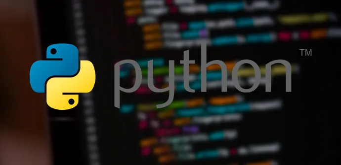

En este archivo vamos a explicar lo que tkinter en Python que es: La mayoría de ustedes escribe un código y lo ejecuta en una terminal de línea de comandos o un IDE (Entorno de desarrollo integrado), y el código produce una salida basada en lo que espera de él, ya sea en la terminal o en el IDE mismo. Sin embargo, ¿qué sucede si desea que su sistema tenga una interfaz de usuario elegante o tal vez su aplicación (caso de uso) requiera que tenga una GUI?

La GUI no es más que una aplicación de escritorio que le proporciona una interfaz que le ayuda a interactuar con las computadoras y enriquece su experiencia de dar un comando (entrada de línea de comandos) a su código. Se utilizan para realizar diferentes tareas en equipos de escritorio, portátiles y otros dispositivos electrónicos, etc.

Algunas de las aplicaciones donde se utiliza el poder de la GUI son:

- Crear una calculadora que tendría una interfaz de usuario y funcionalidades que persisten en una calculadora.
- Los editores de texto, IDE para codificación están en una aplicación GUI.
- Sudoku, Ajedrez, Solitario, etc., son juegos a los que puedes jugar y son aplicaciones GUI.
- Chrome, Firefox, Microsoft Edge, etc., que se utiliza para navegar por Internet es una aplicación GUI.

Veamos algunos de los marcos que proporciona Python para desarrollar una GUI:

- PyQT es uno de los enlaces de Python multiplataforma preferidos que implementan la biblioteca Qt para el marco de desarrollo de aplicaciones Qt. Nokia posee principalmente Qt. Actualmente, PyQT está disponible para casi todos los sistemas operativos como Unix / Linux, Windows, Mac OS X. Combina lo mejor de Python y Qt y brinda flexibilidad al programador para decidir si crear un programa escribiendo un código Python puro o usarlo. Qt Designer para crear diálogos visuales.

- Kivy es para la creación de nuevas interfaces de usuario y es un marco acelerado OpenGL ES 2. Al igual que PyQt , Kivy también es compatible con casi todas las plataformas como Windows, MacOSX, Linux, Android, iOS. Es un marco de código abierto y viene con más de 20 widgets precargados en su kit de herramientas.

Jython es un puerto de Python para Java, que brinda a los scripts de Python un acceso perfecto a las bibliotecas de clases de Java en la máquina local.

- WxPython , inicialmente conocido como WxWindows (ahora como una biblioteca WxWidgets), es un contenedor de nivel abstracto de código abierto para la biblioteca GUI multiplataforma. Está implementado como un módulo de expansión de Python. Con WxPython, usted, como desarrollador, puede crear aplicaciones nativas para Windows, Mac OS y Unix.

- PyGUI es un marco multiplataforma de aplicaciones gráficas para Unix, Macintosh y Windows. En comparación con otros marcos de GUI, PyGUI es, con mucho, el más simple y liviano de todos, ya que la API está puramente sincronizada con Python. PyGUI inserta muy menos código entre la plataforma GUI y la aplicación Python; por lo tanto, la pantalla de la aplicación generalmente muestra la GUI natural de la plataforma.
¡Y finalmente, el marco que es la discusión para el tutorial de hoy Tkinter !

Tkinter comúnmente viene incluido con Python, usando Tk y es el marco de GUI estándar de Python. Es famoso por su simplicidad e interfaz gráfica de usuario. Es de código abierto y está disponible bajo la licencia de Python.

Tkinter : Tkinter es la interfaz de Python para el kit de herramientas de la GUI de Tk que se envía con Python. Buscaríamos esta opción en este capítulo.

wxPython : esta es una interfaz Python de código abierto para el kit de herramientas GUI wxWidgets. Puede encontrar un tutorial completo sobre WxPython aquí .

PyQt : también es una interfaz de Python para una popular biblioteca Qt GUI multiplataforma. TutorialsPoint tiene un muy buen tutorial sobre PyQt aquí .

JPython : JPython es un puerto de Python para Java, que brinda a los scripts de Python un acceso perfecto a las bibliotecas de clases de Java en la máquina local http://www.jython.org .

Veamos un primer ejemplo de ejercicio con uso de tkinter, en la que una ventana, que va a tener una geometry("1350x500"), se lo pasa por parametros a una clase que se va a llamar programa, que va a tener un constructor con el evento __init__(); va a inicializar los parametros de la ventana.

Va a tener 3 metodos (cargar, addTexto, mostrar). En cargar se va a especificar las propiedades de la ventana, y el icono de la ventana, addtexto (texto de la ventana), mostrar para mostrar la ventana (todos esto es una clase programa que se lo llama por medio de instanciar a la clase programa), que se pasa los valores y se llama al metodo mostrar

Programa "01-ventanas.py" (nota para el icono del bitmap debes de descargar un archivo de una carpeta específica de tipo .ico desde www.google.com)

# Tkinter_
# Es un módulo para crear interfaz gráficas de usuario
from tkinter import *
# Importamos la libreria de la ruta para comprobar donde
# esta el archivo de imagen
import os.path
# crear la lventa razi
class Programa:

    def __init__(self, title, icon, icon_alt, size, resizable):
        self.title = title
        self.icon = icon
        self.icon_alt = icon_alt
        self.size = size
        self.resizable = resizable
  
    def cargar(self):

        ventana = Tk()

        self.ventana = ventana
        # Titulo de la ventana
        ventana.title(self.title)

        #Comprobar si existe el archivo
        ruta_icono = os.path.abspath(self.icon)

        if not os.path.isfile(self.icon):
            ruta_icono = os.path.abspath(self.icon_alt)

        # Mostrar texto en el programa
        texto = Label(ventana, text=ruta_icono)
        texto.pack()

        # Icono de la ventana
        ventana.iconbitmap(ruta_icono)
        #Cambio tamaño de la ventana
        ventana.geometry(self.size)

        #Bloquear el tamaño de la ventana
        if self.resizable:
            ventana.resizable(1,1)

        else:
            ventana.resizable(0,0)   

    def addTexto(self, dato):
        texto = Label(self.ventana, text=dato)
        texto.pack()

    def mostrar(self):
        # Arrancar y mostrar la ventana hasta que se cierre
        self.ventana.mainloop()
    

# Instanciar mi programa mediante la clase
programa = Programa('Curso de Master en Python con Victor Robles','./imagenes/07_linkedin.ico','./21-tkinter/imagenes/07_linkedin.ico','1350x500',FALSE)
programa.cargar()
programa.addTexto("Hola! Soy Jose Fernando Frugone Jaramillo")
programa.addTexto("soy Lcdo en Informatica")
programa.addTexto("graduado en la Universidad de Guayaquil")
programa.addTexto("Facultad de Filosofia")
programa.addTexto("tambien realice estudio de Programacion de Microcomputadoras")
programa.addTexto("En la ESPOL")
programa.addTexto("tengo conocimiento de algunos lenguajes como Java, Laravel, Visual Basic.NET")
programa.addTexto("Fox fox, Visual Fox Pro 9, Python y otras herramientas")
programa.mostrar()

A continuación muestro una pantalla de la ejecución del programa "01-ventanas.py"

  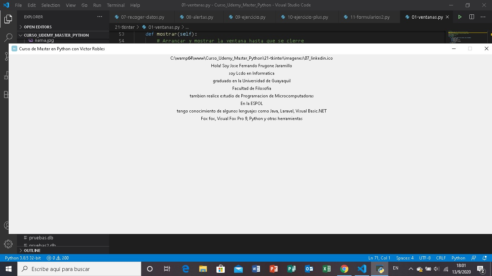

A continuación se muestra el programa "02-textos.py" que se hace uso de los Label en tkinter y con la propiedad side, nos permite mostrar en una parte determinada de la ventana los textos en tkinter (sean estos top, n, w, s,nw, ne) y con anchor = "nw" por ejemplo, donde muestra los datos personales de una persona, adjunto código:

# Importamos la libreria tkinter
from tkinter import *
import os.path
import datetime
# Creamos la ventana raiz
ventana = Tk()
# Tamaño de la ventana
ventana.geometry("500x500")

icono_alt = os.path.abspath('./imagenes/rostro.ico')

# Para añadir icono en la ventana
if not os.path.isfile('./imagenes/rostro.ico'):
    icono_alt = os.path.abspath('./21-tkinter/imagenes/rostro.ico')

ventana.iconbitmap(icono_alt)

def caracteres(saludo, nombre):
    return f"Hola! {saludo} ¿como estas {nombre}"

# Añadir texto a la ventana
texto = Label(ventana, text=caracteres(saludo="Bienvenido a mi programa",nombre="Lcdo. Jose Fernando"))
texto.config(
    fg="green",
    bg="yellow",
    padx=20,
    pady=20,
    font=("Tahoma", 12),
    anchor=W,
    cursor="arrow"
)
texto.pack(side=TOP)

def pruebas(apellido, pais):
    return f"{apellido} veo que eres de {pais}"

texto = Label(ventana, text=pruebas(apellido="Frugone Jaramillo?",pais="Ecuador"))
texto.config(
     fg="green",
     bg="orange",
     padx=20,
     pady=20,
     font=("Tahoma", 15),
     justify=RIGHT,
     cursor="arrow"
)
texto.pack(side=TOP)

def addTexto(est_sup, universidad):
    return f"{est_sup} de la {universidad}"

texto = Label(ventana, text=addTexto(est_sup="Lcdo. en Informatica",universidad="Universidad de Guayaquil"))
texto.config(
    fg="red",
    bg="cyan",
    padx=20,
    pady=20,
    font=("Tahoma", 15),
    justify=CENTER,
    cursor="arrow"
)

texto.pack(side=TOP, fill=X, expand=YES)

def addText2(otros_est):
    return f"{otros_est}"

texto = Label(ventana, text=addText2(otros_est="Prog. de Microcomputadoras"))
texto.config(
    fg="blue",
    bg="yellow",
    padx=20,
    pady=20,
    font=("Tahoma",15),
    justify=CENTER,
    cursor="arrow"
)

texto.pack(side=TOP, fill=X, expand=YES)

def addTexto3(fecha):
    return f"{fecha}"

texto = Label(ventana, text=addTexto3(fecha=datetime.datetime.now()))
texto.config(
    fg="green",
    bg="red",
    padx=20,
    pady=20,
    font=("Tahoma",15),
    justify=CENTER,
    anchor=SW,
    cursor="arrow"
)

texto.pack(side=TOP)

ventana.resizable(1,1)

ventana.mainloop()

  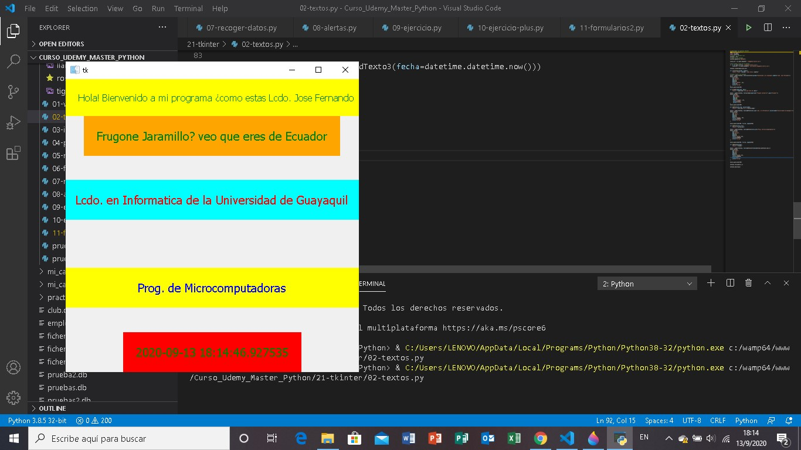

- Tratamientos de imagenes en Python (Pillow Python)

Para tratar imagenes en Python hacemos uso de una libreria en Python que se llama "Pillow Python" que nos permite tratar las imagenes en Python por lo que en un programa en Python lo que debemos importar las imagenes para importar haces from PIL import Image, ImageTK, pero debemos instalar Pillow Python el link o enlace para poder instalar Pillow Python es:

https://pypi.org/project/Pillow/
(donde desde el simbolo de sistema de windows ponemos pip install Pillow)
https://pillow.readthedocs.io/en/stable/installation.html
(donde tambien lo instalamos al poner el siguiente comando en el simbolo de sistema operativo de windows)
pip install --upgrade Pillow

Ahora bien para que funcione Pillow una vez importado la libreria dentro de la libreria de Pillow hacemos uso de los modulos Image e ImageTk
en Image (establecemos la ruta de donde esta la imagen que se va a cargar) y esto lo asignamos a una variable, sea esta dibujo
dibujo = Image.open("./21-tkinter/imagenes/leon.jpg")
con ImagenTk (renderizamos la imagen para que se pueda ver), así 
render = ImakenTk.PhotoImagen(dibujo)

y con Label (mostramos la imagen)
Label(ventana, imagen=render).pack(anchor=CENTER)

Adjunto el codigo:

# Importamos tkinter
from tkinter import *
# Cargamos el modulo de Imagenes Pillow Python
from PIL import Image, ImageTk
# Creamos la ventana raiz
ventana = Tk()
ventana.title("Imagenes | Curso de master en Python")
ventana.geometry("700x500")

Label(ventana, text="Hola!!, Soy Lcdo. José Fernando Frugone Jaramillo").pack(anchor=CENTER)

dibujo = Image.open("./21-tkinter/imagenes/leon.jpg")
render = ImageTk.PhotoImage(dibujo)

Label(ventana, image=render).pack(anchor=CENTER)

ventana.mainloop()

  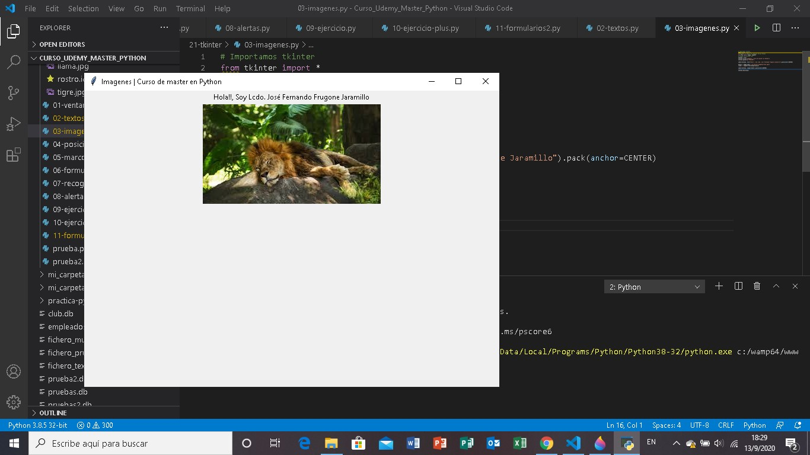

En el siguiente programa de Python "04-posiciones.py", lo que vamos hacer es poner las posiciones de los label en Python en distintos lugares de la ventana, con side y anchor, en la parte de abajo del programa se que se ve que los label esta en side=Left para que esten juntos (Basico 1, Basico 2, Basico 3); adjunto el codigo:

# Importamos la libreria tkinter
from tkinter import *
import os.path
# Creamos la ventana raiz
ventana = Tk()
# Tamaño de la ventana
ventana.geometry("500x500")

icono_alt = os.path.abspath('./imagenes/rostro.ico')

# Para añadir icono en la ventana
if not os.path.isfile('./imagenes/rostro.ico'):
    icono_alt = os.path.abspath('./21-tkinter/imagenes/rostro.ico')

ventana.iconbitmap(icono_alt)

def caracteres(saludo):
    return f"Hola! {saludo}"

# Añadir texto a la ventana
texto = Label(ventana, text=caracteres(saludo="Bienvenido a mi programa"))
texto.config(
    fg="white",
    bg="black",
    padx=10,
    pady=20,
    font=("Tahoma", 15),
    cursor="arrow"
)
texto.pack(side=TOP, fill=X, expand=YES)

def pruebas(nombre):
    return f"Soy {nombre} "

texto = Label(ventana, text=pruebas(nombre="Lcdo. José Fernando Frugone Jaramillo"))
texto.config(
     fg="black",
     bg="orange",
     padx=10,
     pady=20,
     font=("Tahoma", 15),
     cursor="arrow"
)
texto.pack(side=TOP, fill=X, expand=YES)

def addTexto(curso):
    return f"{curso}"

texto = Label(ventana, text=addTexto(curso="Basico 1"))
texto.config(
    height=3,
    bg="green",
    padx=10,
    pady=20,
    font=("Arial", 18),
    cursor="spider"
)

texto.pack(side=LEFT, fill=X, expand=YES)

def addTexto1(curso):
    return f"{curso}"

texto = Label(ventana, text=addTexto1(curso="Basico 2"))
texto.config(
    height=3,
    bg="red",
    padx=10,
    pady=20,
    font=("Arial", 18),
    cursor="spider"
)

texto.pack(side=LEFT, fill=X, expand=YES)

def addTexto2(curso):
    return f"{curso}"

texto = Label(ventana, text=addTexto2(curso="Basico 3"))
texto.config(
    height=3,
    bg="yellow",
    padx=10,
    pady=20,
    font=("Arial", 18),
    cursor="spider"
)

texto.pack(side=LEFT, fill=X, expand=YES)

ventana.resizable(1,1)

ventana.mainloop()

  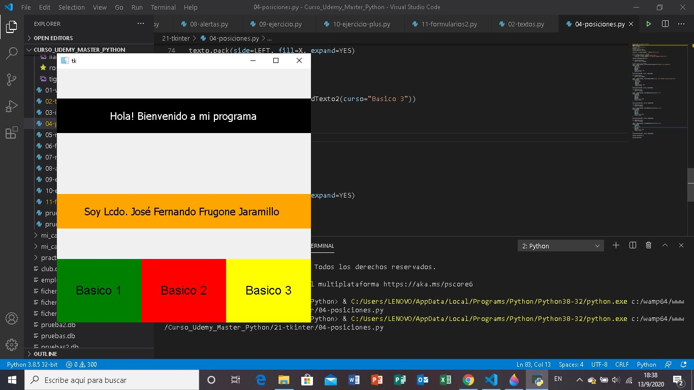

En el siguiente programa "05-marcos.py" se va hacer el uso de los Frame (marcos), los frames en tkinter nos permite realizar marcos en pantalla dentro de la ventana de tkinter, para definir los marcos en pantalla simplemente ponemos Frame(ventana, width=250, height=250), y configuramos las caracteristicas
Frame.config(
    bg="green",
    bd=12,
    relief="raised"
  ),
Frame.pack_propagate(False) // para que no se distorcione el tamaño del marco

adjunto el codigo:

# importamos tkinter
from tkinter import *
# para importar el logo en la ventana
import os.path

ventanas = Tk()
ventanas.title("Marcos | Curso de Master en Python")
ventanas.geometry("700x700")

ruta_icono = os.path.abspath('./21-tkinter/imagenes/rostro.ico')

if not os.path.abspath('./imagenes/rostro.ico'):
    ruta_icono = os.path.abspath('./21-tkinter/imagenes/rostro.ico')

ventanas.iconbitmap(ruta_icono)
# 1er Marco Padre
marco_padre = Frame(ventanas, width=250, height=250)
marco_padre.config(
    bg="lightblue",
    bd=5,
    relief="raised"
)
marco_padre.pack(side=TOP, anchor=N,fill=X,expand=YES)

# Elemento de cuadro 1 del 1er Marco padre
marco = Frame(marco_padre, width=250, height=250)
marco.config(
    bg="green",
    bd=12,
    relief="raised"
)
marco.pack(side=LEFT, anchor=NW)
marco.pack_propagate(False)
# Centrado de texto
texto = Label(marco, text="1er. marco")
texto.config(
    bg="red",
    fg="white",
    font=("Arial",20),
    height=10,
    width=10,
    bd=3,
    relief=SOLID,
    anchor=CENTER
)
texto.pack(side=BOTTOM, anchor=CENTER)

# Elemento del cuadro 2 del 1er Marco padre
marco = Frame(marco_padre, width=250, height=250)
marco.config(
    bg="orange",
    bd=12,
    relief="raised"
)
marco.pack(side=RIGHT, anchor=NE)
marco.pack_propagate(False)

texto = Label(marco, text="2do. marco")
# Centrar el texto
texto.config(
    bg="red",
    fg="white",
    font=("Arial",20),
    height=10,
    width=10,
    bd=3,
    relief=SOLID,
    anchor=CENTER
)
texto.pack(side=BOTTOM, anchor=CENTER)

# 2do marco Padre
marco_padre = Frame(ventanas, width=250, height=250)
marco_padre.config(
    bg="cyan",
    bd=5,
    relief="raised"
)
marco_padre.pack(side=TOP, anchor=CENTER, fill=X, expand=YES)

# Elemento cuadro 1 del 2do marco padre
marco = Frame(marco_padre, width=250, height=250)
marco.config(
    bg="blue",
    bd=12,
    relief="raised"
)
marco.pack(side=LEFT,anchor=W)
marco.pack_propagate(False)

texto = Label(marco, text="3er. marco")
# Centrar el texto
texto.config(
    bg="red",
    fg="white",
    font=("Arial",20),
    height=10,
    width=10,
    bd=3,
    relief=SOLID,
    anchor=CENTER
)
texto.pack(side=BOTTOM, anchor=CENTER)

# Elemento cuadro 2 del 2do marco padre
marco = Frame(marco_padre, width=250, height=250)
marco.config(
    bg="brown",
    bd=12,
    relief="raised"
)
marco.pack(side=RIGHT,anchor=E)
marco.pack_propagate(False)

texto = Label(marco, text="4to. marco")
# centrar el texto
texto.config(
    bg="red",
    fg="white",
    font=("Arial",20),
    height=10,
    width=10,
    bd=3,
    relief=SOLID,
    anchor=CENTER
)
texto.pack(side=BOTTOM, anchor=CENTER)

# 3er Marco Padre
marco_padre = Frame(ventanas, width=250, height=250)
marco_padre.config(
    bg="lightblue",
    bd=5,
    relief="raised"
)
marco_padre.pack(side=TOP, anchor=S,fill=X,expand=YES)

# 1er cuadro del 3er marco padre
marco = Frame(marco_padre, width=250, height=250)
marco.config(
    bg="red",
    bd=12,
    relief="raised"
)
marco.pack(side=LEFT, anchor=SW)
marco.pack_propagate(False)

texto = Label(marco, text="5to. marco")
# centrar el texto
texto.config(
    bg="red",
    fg="white",
    font=("Arial",20),
    height=10,
    width=10,
    bd=3,
    relief=SOLID,
    anchor=CENTER
)
texto.pack(side=BOTTOM,anchor=CENTER)
# 2do cuadro del 3er marco padre
marco = Frame(marco_padre, width=250, height=250)
marco.config(
    bg="green",
    bd=12,
    relief="raised"
)
marco.pack(side=RIGHT, anchor=SE)
marco.pack_propagate(False)

texto = Label(marco, text="6to. marco")
# centrar el texto
texto.config(
    bg="red",
    fg="white",
    font=("Arial",20),
    height=10,
    width=10,
    bd=3,
    relief=SOLID,
    anchor=CENTER
)
texto.pack(side=BOTTOM,anchor=CENTER)
ventanas.mainloop()

  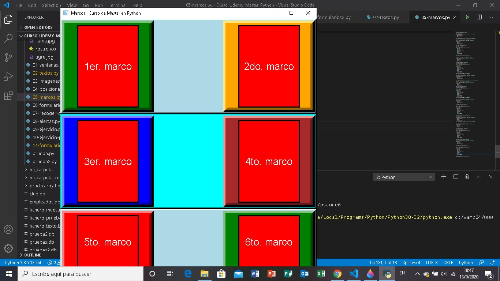

En el siguiente ejercicio "06-formularios.py" lo que se va hacer es un formulario de Python que nos permite crear una ventana de Python y crear dos cajas de textos (una para los nombres, y otra para los apellidos), y campo grande que dice descripción y un boton enviar

Código 

# Programa para crear formularios en tkinter
from tkinter import *
# ventana del formulario
import os.path
ventana = Tk()
# dimensiones de la ventana
ventana.geometry("700x500")
# icono
icono_ventana = os.path.abspath('./imagenes/rostro.ico')

if not os.path.isfile('./imagenes/rostro.ico'):
    icono_ventana = os.path.abspath('./21-tkinter/imagenes/rostro.ico')

ventana.iconbitmap(icono_ventana)
ventana.title("Formularios en tkinter | Lcdo Jose Frugone")

# texto encabezado
encabezado = Label(ventana, text="Formulario en Tkinter | Lcdo Jose Frugone")
encabezado.config(
    fg="white",
    bg="darkgrey",
    font=("Open Sans",18),
    padx=10,
    pady=10
)
encabezado.grid(row=0, column=0, columnspan=6, sticky=N)

# Label para el campo (Nombre)
etiqueta = Label(ventana, text="Nombre")
etiqueta.grid(row=1, column=0, sticky=W, padx=5, pady=5)

# campo de texto
campo_texto = Entry(ventana)
campo_texto.grid(row=1, column=1, sticky=W, padx=5, pady=5)
campo_texto.config(justify="left", state="normal", bg="yellow",fg="red", font=("Tahoma",10))

# Label para el campo (Apellido)
etiqueta = Label(ventana, text="Apellidos")
etiqueta.grid(row=2, column=0, sticky=W, padx=5, pady=5)

# campo de texto
campo_texto = Entry(ventana)
campo_texto.grid(row=2, column=1, sticky=W, padx=5, pady=5)
campo_texto.config(justify="left", state="normal", bg="yellow",fg="red", font=("Tahoma",10))

# Label para el campo (Descripcion)
etiqueta = Label(ventana, text="descripcion")
etiqueta.grid(row=3, column=0, sticky=W, padx=5, pady=5)

# Campo de texto para ingresar datos grandes
campo_grande = Text(ventana)
campo_grande.grid(row=3, column=1, sticky=W)
campo_grande.config(
     width="15",
     height="5",
     bg="cyan",
     fg="red",
     font=("Tahoma",10),
     padx=5,
     pady=5
)
# Para crear botones
Label(ventana).grid(row=8, column=1)

boton = Button(ventana, text="Enviar")
boton.grid(row=9, column=1, sticky=W)
boton.config(
    padx=10,
    pady=10,
    bg="green",
    fg="white"
)    

ventana.mainloop()

  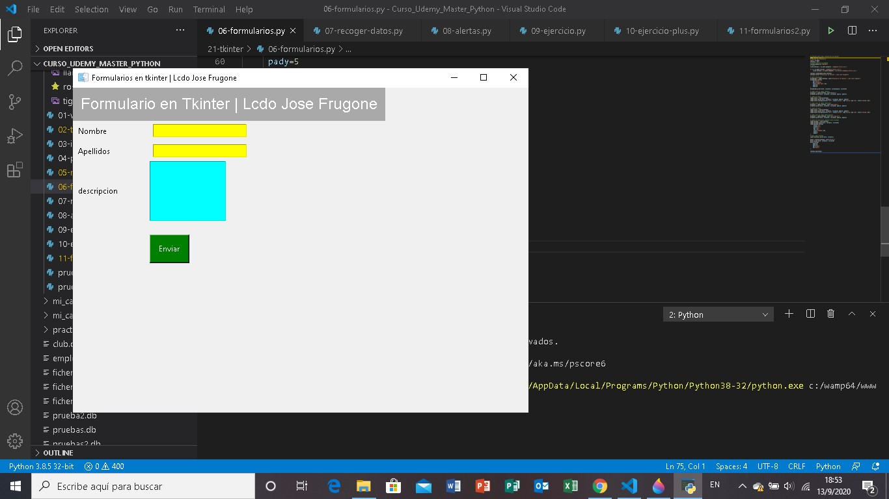

En el siguiente ejercicio "07-recoger-datos.py" lo que hace en este ejercicio de Python es lo que ingresa en una caja de texto al dar un click en el boton "Mostrar dato" que ejecuta la funcion de Python getDato(), que lo que hace es getDato(), es asignado en la variable resultado, obtiene lo que se ingreso a la caja de texto que esta asignado a una variable que es un StringVar(), a continuación muestro el código :

from tkinter import *
from PIL import Image, ImageTk
import os.path
# Se crea la ventana
ventana = Tk()
ventana.geometry("700x400")
ventana.title("Tkinter Recoger datos de un formulario")
# Icono para la ventana
icono_ventana = os.path.abspath('./imagenes/rostro.ico')

if not os.path.isfile('./imagenes/rostro.ico'):
    icono_ventana = os.path.abspath('./21-tkinter/imagenes/rostro.ico')

ventana.iconbitmap(icono_ventana)

texto = Label(ventana, text="Ingresa un texto :")
texto.config(
    bg="darkgrey",
    fg="blue",
    font=("Arial",10)
)
texto.pack(side=TOP, anchor=NW)

marco = Frame(ventana, width=250, height=250)
marco.config(
    bg="cyan",
    bd=5,
    relief="raised"
)
marco.pack(side=RIGHT, anchor=NE)

dibujo = Image.open("./21-tkinter/imagenes/conejo.jpg")
render = ImageTk.PhotoImage(dibujo)

Label(marco, image=render).pack()

def getDato():
    resultado.set(dato.get())

    if len(resultado.get()) >= 1:
        texto.config(
            bg="green",
            fg="white"
        )

dato = StringVar()
resultado = StringVar()

campo = Entry(ventana, textvariable=dato)
campo.config(
    bg="yellow",
    fg="red",
    font=("Tahoma",10)
)
campo.pack(side=TOP, anchor=NW, padx=10, pady=10)

texto = Label(ventana, text="Datos Recogido :")
texto.config(
    bg="darkgrey",
    fg="blue",
    font=("Arial",10)
)
texto.pack(side=TOP, anchor=NW)

texto = Label(ventana, textvariable=resultado)
texto.config(
    width="80",
    height="5",
    bg="cyan",
    fg="red",
    font=("Tahoma",10)
)
texto.pack(side=TOP, anchor=W, padx=10, pady=10)

# Boton
boton = Button(ventana, text="Mostrar dato", command=getDato)
boton.config(
    width="10",
    height="5",
    bg="yellow",
    fg="red",
    font=("Tahoma",10)
)
boton.pack(side=LEFT, anchor=SW, padx=10, pady=10)

ventana.mainloop()

  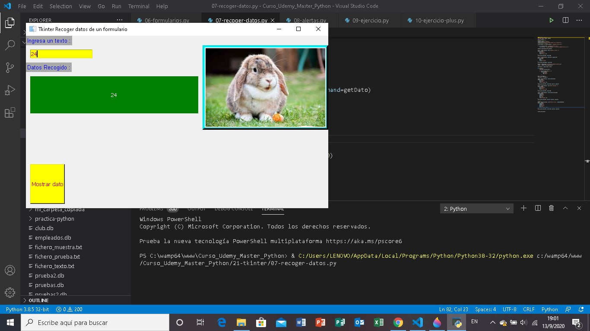

Alertas en tkinter: 
Un cuadro de diálogo es una ventana con un título, un mensaje, un ícono y uno o más botones. Se emplea para informar al usuario sobre alguna cuestión o bien exhortarlo a tomar una decisión.

Las funciones para generar cuadros de diálogo en una aplicación de Tcl/Tk están definidas en el módulo tkinter.messagebox (tkMessageBox en Python 2), y son las siguientes:

showinfo()
showwarning()
showerror()
askquestion()
askyesno()
askokcancel()
askyesnocancel()
askretrycancel()
Todas reciben los argumentos message y title, que indican el mensaje y el título del cuadro de diálogo. Por ejemplo:

from tkinter import messagebox
messagebox.showinfo(message="Mensaje", title="Título")

Mientras el cuadro de diálogo está abierto, el resto de los controles (widgets) dentro de la ventana no responden a ningún evento (por ejemplo, presionar sobre un botón). Este comportamiento se conoce en la jerga del desarrollo aplicaciones de escritorio como modal.

El ícono desplegado por cada una de las funciones es provisto por el sistema operativo, aunque siempre en relación con el mensaje que pretende comunicar el cuadro. Por ejemplo, el ícono de showinfo() es por lo general azul o celeste e indica información; el de showwarning(), amarillo o naranja denotando advertencia; el de showerror(), rojo indicando error.

En el siguiente código del programa "08-alertas.py", muestras las alertas

# importamos tkinter
from tkinter import *
# importamos mensajes para alertas
from tkinter import messagebox
import os.path
# para importar imagenes
from PIL import Image, ImageTk

ventana = Tk()
ventana.geometry("700x500")
ventana.title("Alertas en Tkinter | Lcdo José Fernando Frugone Jatamillo")
ventana.config(
    bd=70,
    bg="#ccc"
)

#icono de la ventana
icono_ventana = os.path.abspath('./imagenes/rostro.ico')

if not os.path.isfile('./imagenes/rostro.ico'):
    icono_ventana = os.path.abspath('./21-tkinter/imagenes/rostro.ico')

ventana.iconbitmap(icono_ventana)
# Marco para la Imagen
marco = Frame(ventana, width=250, height=250)
marco.config(
    bg="cyan",
    bd=5,
    relief="raised"
)
marco.pack(side=RIGHT, anchor=NE)

dibujo = Image.open("./21-tkinter/imagenes/ardilla.jpg")
render = ImageTk.PhotoImage(dibujo)

def sacarAlerta():
    messagebox.showinfo("Alerta","Soy Lcdo. Jose Fernando Frugone Jaramillo")

def salir(nombre):
    resultado = messagebox.askquestion("Salir","¿Continuar con la ejecucion (S/N) :")

    if resultado !="yes":
        messagebox.showinfo("Adios!!!", f"Hasta pronto {nombre}")
        ventana.destroy()

Label(marco, image=render).pack()
boton = Button(ventana, text="Mostrar alerta!!!", command=sacarAlerta)
boton.config(
    bg="green",
    fg="white",
    width=20,
    height=5,
    padx=5,
    pady=5
)
boton.pack(side=BOTTOM, anchor=SW)

boton = Button(ventana, text="Salir!!", command=lambda: salir("Lcdo Jose Fernando Frugone Jaramillo"))
boton.config(
    bg="magenta",
    fg="white",
    width=20,
    height=5,
    padx=5,
    pady=5
)
boton.pack(side=BOTTOM, anchor=SW)

ventana.mainloop()

  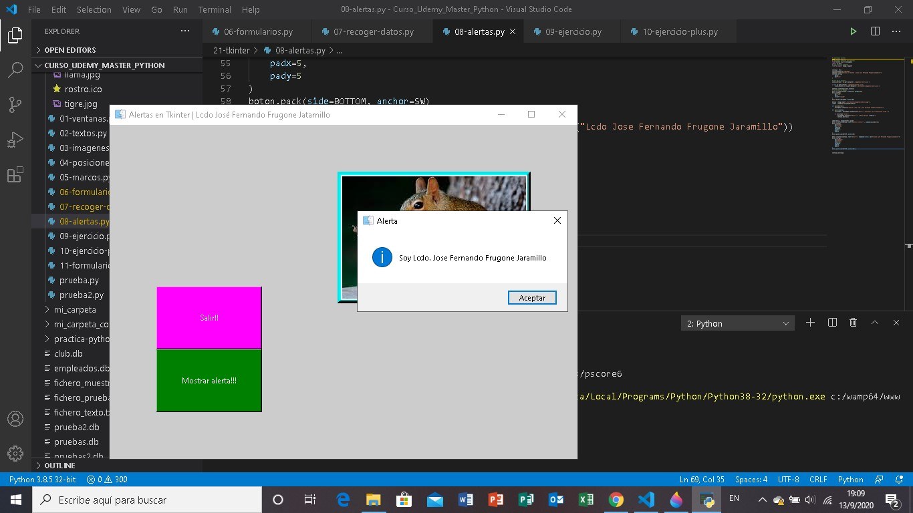

En el siguiente ejercicio de Python vamos hacer una calculadora "09-ejercicio.py" en donde vamos a ingresar nos numeros en dos cajas de textos y dependiendo de la operacion seleccionada en la suma, resta, multiplicacion y division que esta en unos botones de comandos hace el ejercicio y el resultado debe de mostrar en un cuadro de diálogo (messagebox)

  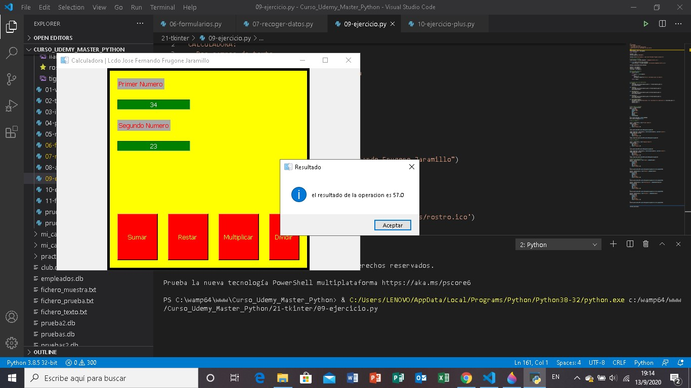

En el sigiente ejercicio de tkinter "11-formulario2.py", vamos hacer uso de los CheckBox(), RadioButton() y OptionMenu(), en los CheckBox se va a preguntar la profesion de que te dedicas donde al seleccionar la profesional que te dedicas aparece en pantalla lo seleccionado.
En el mismo ejercicio los Radio Button() de tkinter en Python va a preguntar el sexo ¿si eres masculino o femenino?, el que seleccionar aparece en pantalla, y OptionMenu() de tkinter aparece 3 opciones en las cuales al seleccionar cada una de ellas va a paracer en la parte de abajo la opcion escogida.

Adjunto el código:

# Cargamos la libreria de tkinter
from tkinter import *
import os.path

ventana = Tk()

ventana.geometry("800x400")

ventana.title("Ejercicia 11 | Lcdo. Jose Fernando Frugone Jaramillo")

ruta_imagen = os.path.abspath('./imagenes/rostro.ico')

if not os.path.isfile(ruta_imagen):
    ruta_imagen = os.path.abspath('./21-tkinter/imagenes/rostro.ico')

ventana.iconbitmap(ruta_imagen)

# Encabezado
encabezado = Label(ventana, text="Formulario 2")
encabezado.config(
    padx=15,
    pady=15,
    fg="white",
    bg="green",
    font=("Tahoma",14)
)
encabezado.grid(row=0, column=0, columnspan=5, sticky=N)

texto = Label(ventana, text="A que te dedicas?")
texto.config(
    bg="green",
    fg="red",
    font=("Tahoma",10)
)
texto.grid(row=1, column=0, sticky=N)

# Botones check
def mostrarProfesion():
    texto = ""

    if web.get():
        texto += "Desarrollo web"

    if mobil.get():
        if web.get():
            texto += "\n"
            texto += "y Desarrollo mobil"
        else:
            texto += "Desarrollo mobil"    

    mostrar.config(
        text=texto,
        bg="green",
        fg="white"
        )    

web = IntVar()
mobil = IntVar()

Checkbutton(
    ventana,
    text="Desarrollo web",
    variable=web,
    onvalue=1,
    offvalue=0,
    command=mostrarProfesion
    ).grid(row=2, column=0)
Checkbutton(
    ventana,
    text="Desarrollo mobil",
    variable=mobil,
    onvalue=1,
    offvalue=0,
    command=mostrarProfesion
    ).grid(row=3, column=0)

mostrar = Label(ventana, text="", bg="green")
mostrar.grid(row=4, column=0)

# Radio Botton
def marcar():
    marcado.config(
        text=opcion1.get(),
        bg="green",
        fg="white",
        font=("Tahoma",10)
    )

opcion1 = StringVar()
opcion1.set(None)
texto = Label(ventana, text="Cual es tu genero?")
texto.config(
    bg="green",
    fg="red",
    font=("Tahoma",10)
)
texto.grid(row=5, column=0, sticky=N)

Radiobutton(
    ventana,
    text="Masculino",
    value="Masculino",
    variable=opcion1,
    command=marcar
    ).grid(row=6)

Radiobutton(
    ventana,
    text="Femenino",
    value="Femenino",
    variable=opcion1,
    command=marcar
    ).grid(row=7)

marcado = Label(ventana)
marcado.grid(row=8, column=0)

# Option Menu
def escoger():
    escogido.config(
        text=opcion.get(),
        bg="green",
        fg="white",
        font=("Tahoma",10)
    )

opcion = StringVar()

texto = Label(ventana, text="Selecciona una opcion")
texto.config(
    bg="red",
    fg="green",
    font=("Tahoma",12)
)
texto.grid(row=10, column=1)

selecciona = OptionMenu(ventana, opcion, "Opcion 1", "Opcion 2", "Opcion 3")
selecciona.grid(row=11, column=1)

escogido = Label(ventana)
boton = Button(ventana, text="ver",command=escoger)
boton.config(
    bg="green",
    fg="white",
    font=("Tahoma",10)
)
boton.grid(row=12, column=1)
escogido.grid(row=13, column=1)

ventana.mainloop()

  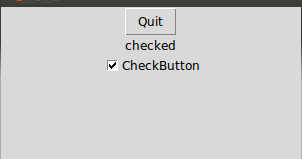

  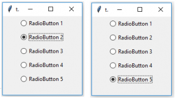
  

  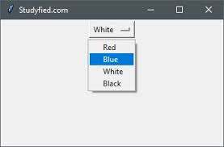

  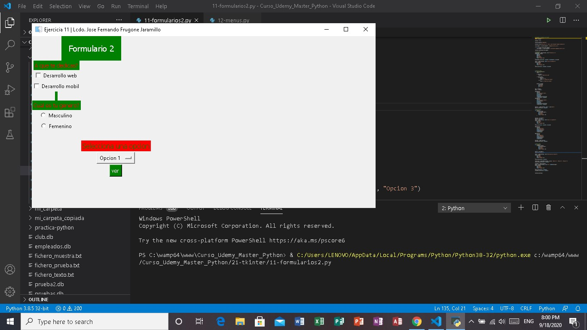

   

Ejercicio "12-menus.py" # Que lo encuentras en la carpeta './21-tkinter/' del repositorio

En el siguiente ejercicio de tkinter vamos a aprender a realizar menus y desplegables con tkinter para ello primero importamos el modulo de tkinter from tkinter import *
si queremos poder un logo en la ventana de Python importamos la libreria respectiva para manejo de archivo y ruto import os.path
Como siguiente paso creamos la ventana de Python ventana = Tk()

icono_ventana = os.path.abspath('./imagenes/rostro.ico')
if not os.path.isfile(icono_ventana):
    icono_ventana = os.path.abspath('./21-tkinter/imagenes/rostro.ico')

ventana.iconbitmap(icono_ventana)
ventana.title("Menus de ejemplo de Visual Studio Code | Lcdo. Jose Fernando Frugone Jaramillo")

Para la utilizacion de menu se utiliza un modulo de menu que va a estar dentro de la ventana de tkinter y esta a la vez va a estar asignada a una variable
mi_menu = Menu(ventana)

Definimos dentro de la configutacion de la ventana con la opcion menu el nombre del menu que hemos creados asi de esta manera:

ventana.config(
     menu=mi_menu,
     bg="green",
     bd=25
)

# Para este ejercicio del menu nos basamos en las opciones del Programa "Visual Studio Code"

archivo = Menu(ventana, tearoff=0)
archivo.add_command(label="Nuevo archivo")
archivo.add_command(label="Nueva ventana")
archivo.add_separator()
archivo.add_command(label="Abrir Archivo")
archivo.add_command(label="Abrir Carpeta")
archivo.add_command(label="Abrir Espacio de trabajo")
archivo.add_command(label="Abrir Carpeta a espacio de trabajo")
archivo.add_command(label="Grabar espacio de trabajo como")
archivo.add_separator()
archivo.add_command(label="Grabar")
archivo.add_command(label="Grabar como")
archivo.add_command(label="Grabar Todo")
archivo.add_separator()
archivo.add_command(label="Auto Save")
archivo.add_command(label="Preferences")
archivo.add_separator()
archivo.add_command(label="Revert File")
archivo.add_command(label="Cerrar Editar")
archivo.add_command(label="Cerrar carpeta")
archivo.add_command(label="Cerrar Windows")
archivo.add_separator()
archivo.add_command(label="Salir", command=ventana.quit)

editar = Menu(ventana, tearoff=0)
editar.add_command(label="Undo")
editar.add_command(label="Redo")
editar.add_separator()
editar.add_command(label="Cortar")
editar.add_command(label="Copiar")
editar.add_command(label="Pegar")
editar.add_separator()
editar.add_command(label="Encontrar")
editar.add_command(label="Reemplazar")
editar.add_separator()
editar.add_command(label="Find in Files")
editar.add_command(label="Replaces in Files")
editar.add_separator()
editar.add_command(label="Toggle Line Comment")
editar.add_command(label="Toggle Block Comment")
editar.add_separator()
editar.add_command(label="Emmet: Expand Abrevviation")

seleccion = Menu(ventana, tearoff=0)
seleccion.add_command(label="Selecciona todo")
seleccion.add_command(label="Expand Selection")
seleccion.add_command(label="Shrink Selection")
seleccion.add_separator()
seleccion.add_command(label="Copy Line Up")
seleccion.add_command(label="Copy Line Down")
seleccion.add_command(label="Move Line Up")
seleccion.add_command(label="Duplicate Selection")
seleccion.add_separator()
seleccion.add_command(label="Add Cursor Above")
seleccion.add_command(label="Add Cursor to Line Ends")
seleccion.add_command(label="Add Next Occurrences")
seleccion.add_command(label="Add Previous Occurrences")
seleccion.add_command(label="Select All Occurrences")
seleccion.add_separator()
seleccion.add_command(label="Switch to Ctrl+Click For Multi-Cursor")
seleccion.add_command(label="Column Selection Mode")

Para crear un menu y que va a tener un submenu desplegable con add_cascade, asi

mi_menu.add_cascade(label="Archivo", menu=archivo)
mi_menu.add_cascade(label="Editar", menu=editar)
mi_menu.add_cascade(label="Seleccionar", menu=seleccion)

# Codigo completo del ejercicio

# Invocamos la libreria de tkinter
from tkinter import *
import os.path
# creamos la ventana
ventana = Tk()
ventana.geometry("800x600")

icono_ventana = os.path.abspath('./imagenes/rostro.ico')
if not os.path.isfile(icono_ventana):
    icono_ventana = os.path.abspath('./21-tkinter/imagenes/rostro.ico')

ventana.iconbitmap(icono_ventana)
ventana.title("Menus de ejemplo de Visual Studio Code | Lcdo. Jose Fernando Frugone Jaramillo")

# Para los menus
mi_menu = Menu(ventana)
ventana.config(
    menu=mi_menu,
    bg="green",
    bd=25
)

archivo = Menu(ventana, tearoff=0)
archivo.add_command(label="Nuevo archivo")
archivo.add_command(label="Nueva ventana")
archivo.add_separator()
archivo.add_command(label="Abrir Archivo")
archivo.add_command(label="Abrir Carpeta")
archivo.add_command(label="Abrir Espacio de trabajo")
archivo.add_command(label="Abrir Carpeta a espacio de trabajo")
archivo.add_command(label="Grabar espacio de trabajo como")
archivo.add_separator()
archivo.add_command(label="Grabar")
archivo.add_command(label="Grabar como")
archivo.add_command(label="Grabar Todo")
archivo.add_separator()
archivo.add_command(label="Auto Save")
archivo.add_command(label="Preferences")
archivo.add_separator()
archivo.add_command(label="Revert File")
archivo.add_command(label="Cerrar Editar")
archivo.add_command(label="Cerrar carpeta")
archivo.add_command(label="Cerrar Windows")
archivo.add_separator()
archivo.add_command(label="Salir", command=ventana.quit)

editar = Menu(ventana, tearoff=0)
editar.add_command(label="Undo")
editar.add_command(label="Redo")
editar.add_separator()
editar.add_command(label="Cortar")
editar.add_command(label="Copiar")
editar.add_command(label="Pegar")
editar.add_separator()
editar.add_command(label="Encontrar")
editar.add_command(label="Reemplazar")
editar.add_separator()
editar.add_command(label="Find in Files")
editar.add_command(label="Replaces in Files")
editar.add_separator()
editar.add_command(label="Toggle Line Comment")
editar.add_command(label="Toggle Block Comment")
editar.add_separator()
editar.add_command(label="Emmet: Expand Abrevviation")

seleccion = Menu(ventana, tearoff=0)
seleccion.add_command(label="Selecciona todo")
seleccion.add_command(label="Expand Selection")
seleccion.add_command(label="Shrink Selection")
seleccion.add_separator()
seleccion.add_command(label="Copy Line Up")
seleccion.add_command(label="Copy Line Down")
seleccion.add_command(label="Move Line Up")
seleccion.add_command(label="Duplicate Selection")
seleccion.add_separator()
seleccion.add_command(label="Add Cursor Above")
seleccion.add_command(label="Add Cursor to Line Ends")
seleccion.add_command(label="Add Next Occurrences")
seleccion.add_command(label="Add Previous Occurrences")
seleccion.add_command(label="Select All Occurrences")
seleccion.add_separator()
seleccion.add_command(label="Switch to Ctrl+Click For Multi-Cursor")
seleccion.add_command(label="Column Selection Mode")

visualiza = Menu(ventana, tearoff=0)
visualiza.add_command(label="Command Pallete")
visualiza.add_command(label="Open View")
visualiza.add_separator()
visualiza.add_command(label="Appaarence")
visualiza.add_command(label="Editor Layout")
visualiza.add_separator()
visualiza.add_command(label="Explorer")
visualiza.add_command(label="Search")
visualiza.add_command(label="SCM")
visualiza.add_command(label="Run")
visualiza.add_command(label="extensions")
visualiza.add_separator()
visualiza.add_command(label="Output")
visualiza.add_command(label="Debug Console")
visualiza.add_command(label="Terminal")
visualiza.add_command(label="Problems")
visualiza.add_separator()
visualiza.add_command(label="Toggle Word Wrap")
visualiza.add_command(label="Show Minimap")
visualiza.add_command(label="Show Breadcrumbs")
visualiza.add_command(label="Render Whitespace")
visualiza.add_command(label="Render Control Characters")

ir = Menu(ventana,tearoff=0)
ir.add_command(label="Back")
ir.add_command(label="Forward")
ir.add_command(label="Last Edit Location")
ir.add_separator()
ir.add_command(label="Switch Editor")
ir.add_command(label="Switch Group")
ir.add_separator()
ir.add_command(label="Go to File....")
ir.add_command(label="Go To Symbol in Workspace")
ir.add_separator()
ir.add_command(label="Go to Symbol in Editor")
ir.add_command(label="Go to Definition")
ir.add_command(label="Go to Declaration")
ir.add_command(label="Go to Implementations")
ir.add_command(label="Go to references")
ir.add_separator()
ir.add_command(label="Go to Line/Column")
ir.add_command(label="Go To Bracket")
ir.add_separator()
ir.add_command(label="Next Problema")
ir.add_command(label="Previos Problem")
ir.add_separator()
ir.add_command(label="Next Change")
ir.add_command(label="Previous Change")

mi_menu.add_cascade(label="Archivo", menu=archivo)
mi_menu.add_cascade(label="Editar", menu=editar)
mi_menu.add_cascade(label="Seleccionar", menu=seleccion)
mi_menu.add_cascade(label="Ver", menu=visualiza)
mi_menu.add_cascade(label="Go", menu=ir)

ventana.mainloop()

  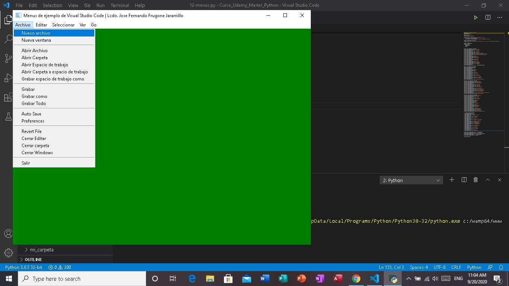

 

